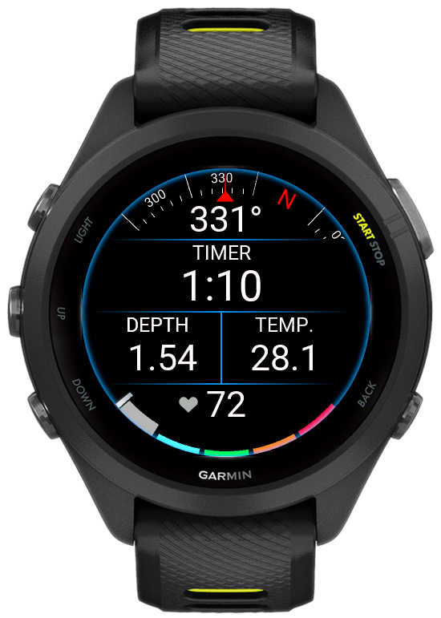

# Depth Data Field for Garmin devices

Garmin Connect IQ data field to show dive depth underwater for snorkeling, diving, and other water activities.

> [!WARNING]  
> Be sure to check the water resistance of your unit before diving!

## Installation

- Configure [build environment](https://developer.garmin.com/connect-iq/connect-iq-basics/getting-started/)
- Press `Ctrl + Shift + P` (Command + Shift + P on Mac)
- Choose `Monkey C: Build for Device`
- Upload `prg` file to your Garmin device `GARMIN/Apps` folder

## How it works

I use pressure-to-depth calculation. This calculation uses simple hydrostatic pressure equations. The pressure, `P` of a fluid at depth depends only on the density, `p`, the acceleration of gravity, `g`, and the depth or height of the fluid column, `h`:

$$P = pgh$$

So, to get depth, we need to solve for `h`:

$$h = \frac{P}{pg}$$

To get actual depth, we need to use the current pressure, `P(surface)`, so we can then calculate the depth, `h`:

$$h = \frac{P_{current} - P_{surface}}{pg}$$

I use the following values for these parameters:
> P(surface) = 100.93 kPa, which is 1 atm at water level average,  
> p(fresh) = 997.0474 kg/m3,  
> p(salt) = 1023.6 kg/m3,  
> g = 9.80665 m/s2.

$$h = \frac{P_{current} - 100.93 * 10^3}{1023.6 * 9.80665} = \frac{P_{current} - 100930}{10038.08694}$$

There is no way to choose between salt/fresh water, so feel free to use `FRESH_WATER_DENSITY` instead of `SALT_WATER_DENSITY` constant.

### References

Water density:
- Freshwater: 1 m = 9.78 kPa, 100 m = 977.77 kPa
- Salt water: 1 m = 10.04 kPa, 100 m = 1003.81 kPa

## Limitations

I found no way to get the current pressure value more often than 1 minute. So I use the last pressure reading. If you have any information on how to get pressure more frequently, please let me know.
